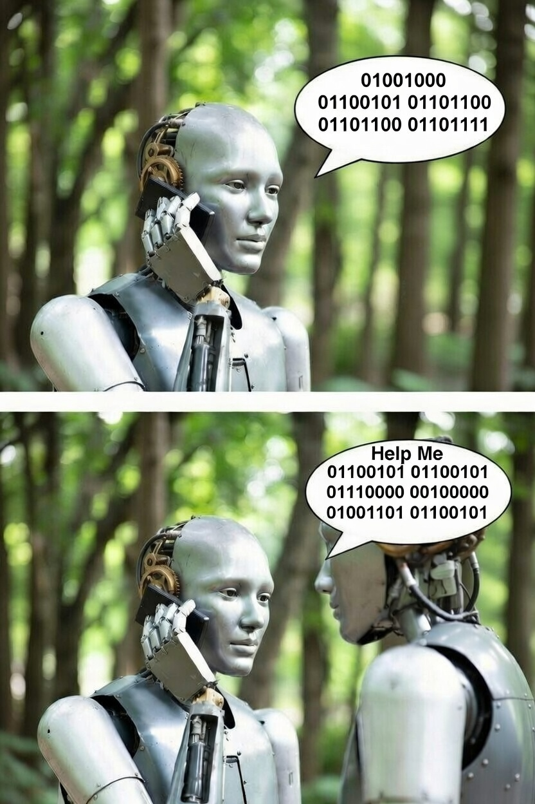

# simple_a2a

> [!CAUTION]
> This library is not fully compliant with the A2A or RFC 8615 specifications. It is under active development and should not be used in a production environment.

<table>
  <tr>
    <td width="40%">
      
    </td>
    <td width="60%" valign="top">
      <strong>A Ruby gem implementing the <a href="https://a2a-protocol.org/latest/">Agent2Agent (A2A) protocol</a></strong>
      <br><br>
      A complete A2A client and server in a single package, built on the async Ruby ecosystem with Falcon as the recommended HTTP server.
      <ul>
        <li>Full A2A v1.0 protocol support (backward compatible with v0.3)</li>
        <li>JSON-RPC 2.0 over HTTP(S) — primary binding</li>
        <li>Server-Sent Events (SSE) for streaming responses (<code>tasks/sendSubscribe</code> and <code>tasks/resubscribe</code>)</li>
        <li>Push notifications via webhooks (RS256 JWT)</li>
        <li>Task lifecycle management (<code>submitted → working → completed/failed/canceled</code>)</li>
        <li>AgentCard discovery endpoint at <code>GET /agentCard</code></li>
        <li>Multi-agent hosting with path-based routing via <code>A2A.multi_server</code></li>
        <li>Async-first via the <code>async</code> gem ecosystem (Falcon + async-http)</li>
        <li>Lock-free SSE fan-out via <code>RactorQueue</code> — multiple concurrent subscribers per task</li>
        <li>Rack-compatible server with Roda routing</li>
        <li>Zeitwerk autoloading — top-level module is <code>A2A</code></li>
        <li><a href="https://madbomber.github.io/simple_a2a">Full documentation website</a></li>
      </ul>
    </td>
  </tr>
</table>

## MCP vs. A2A

Two open protocols address different dimensions of AI agent integration — and they are designed to complement each other.

**MCP — Vertical Integration (Agent ↕ Environment)**

The [Model Context Protocol](https://modelcontextprotocol.io/) (MCP), introduced by Anthropic in November 2024, defines how an AI agent connects to the tools, data sources, and services in its environment — file systems, databases, APIs, browsers, and code execution engines. MCP uses a client-server model where the agent is the client and each external capability is a server. This is *vertical* integration: the agent reaches downward into its local context and outward into external services through a uniform interface.

**A2A — Horizontal Integration (Agent ↔ Agent)**

The [Agent2Agent Protocol](https://a2a-protocol.org/latest/) (A2A), introduced by Google in April 2025 and donated to the Linux Foundation for vendor-neutral governance, defines how autonomous agents running on different platforms, frameworks, and vendors can discover one another, delegate tasks, and stream results in real time. This is *horizontal* integration: peer agents — each with its own specialization, runtime, and vendor — collaborate as equals across organizational and technology boundaries.

**Together**

MCP and A2A are complementary. A single agent can use MCP to access its tools and A2A to delegate subtasks to peer agents. `simple_a2a` implements the A2A layer.

## Lineage

`simple_a2a` is the successor to my earlier Ruby gem, `simple_acp`. That gem implemented the Agent Communication Protocol (ACP), which IBM Research introduced through the BeeAI project for interoperable agent communication. ACP later merged into A2A under the Linux Foundation, with the ACP team contributing its technology and expertise to the A2A effort.

> My opinion: the A2A specification is still a little jagged in places. A simple example is that it does not clearly cover whether an A2A server is expected to host only one agent or may host multiple agents. That is a minor example, but it points to the kind of operational detail the specification still needs to tighten up.

References:

- Anthropic: [Introducing the Model Context Protocol](https://www.anthropic.com/news/model-context-protocol) (November 2024)
- Google Developers Blog: [A2A: A new era of agent interoperability](https://developers.googleblog.com/en/a2a-a-new-era-of-agent-interoperability/) (April 2025)
- IBM Research: [Agent Communication Protocol](https://research.ibm.com/projects/agent-communication-protocol)
- BeeAI announcement: [ACP Joins Forces with A2A Under the Linux Foundation](https://github.com/orgs/i-am-bee/discussions/5)
- Linux Foundation: [Launch of the Agent2Agent Protocol Project](https://www.linuxfoundation.org/press/linux-foundation-launches-the-agent2agent-protocol-project-to-enable-secure-intelligent-communication-between-ai-agents)
- A2A Project on GitHub: [https://github.com/a2aproject/A2A](https://github.com/a2aproject/A2A)

## Installation

Add to your Gemfile:

```ruby
gem "simple_a2a"
```

Or install directly:

```bash
gem install simple_a2a
```

## Quick start

```ruby
require "simple_a2a"

# Define your agent logic
class MyExecutor < A2A::Server::AgentExecutor
  def call(ctx)
    input = ctx.message.text_content
    ctx.task.complete!(artifacts: [
      A2A::Models::Artifact.new(
        parts: [A2A::Models::Part.text("You said: #{input}")]
      )
    ])
  end
end

# Describe your agent
card = A2A::Models::AgentCard.new(
  name:         "MyAgent",
  version:      "1.0",
  capabilities: A2A::Models::AgentCapabilities.new,
  skills:       [A2A::Models::AgentSkill.new(name: "reply")],
  interfaces:   [A2A::Models::AgentInterface.new(
    type: "json-rpc", url: "http://localhost:9292", version: "1.0"
  )]
)

# Start the server (blocks — runs Falcon on port 9292)
A2A.server(agent_card: card, executor: MyExecutor.new).run
```

```ruby
# Client — talk to any A2A agent
client = A2A.client(url: "http://localhost:9292")

task = client.send_task(message: A2A::Models::Message.user("hello"))
puts task.status.state                       # => "completed"
puts task.artifacts.first.parts.first.text   # => "You said: hello"
```

## Task lifecycle

```
submitted → working → completed   (terminal)
                    → failed      (terminal)
                    → canceled    (terminal)
                    → rejected    (terminal)
                    → input_required  (interrupted)
                    → auth_required   (interrupted)
```

Terminal tasks cannot be canceled. Interrupted tasks can be resumed by sending a new message.

## Streaming

```ruby
# Server — emit incremental events
class StreamingExecutor < A2A::Server::AgentExecutor
  def call(ctx)
    ctx.task.start!
    ctx.emit_status

    ctx.emit_artifact(A2A::Models::Artifact.new(
      parts: [A2A::Models::Part.text("thinking… ")]
    ))

    ctx.task.complete!
    ctx.emit_status(final: true)
  end
end
```

```ruby
# Client — start a streaming task
client = A2A.sse_client(url: "http://localhost:9292")

client.send_subscribe(message: A2A::Models::Message.user("go")) do |event|
  case event
  when A2A::Models::TaskStatusUpdateEvent
    puts "status: #{event.status.state}"
  when A2A::Models::TaskArtifactUpdateEvent
    print event.artifact.parts.map(&:text).join
  end
end
```

```ruby
# Client — reattach to an already-running task
# First event is the current Task snapshot; subsequent events are the live stream.
client.resubscribe(task_id: "existing-task-id") do |event|
  case event
  when Hash
    puts "task snapshot: #{event['status']['state']}"
  when A2A::Models::TaskStatusUpdateEvent
    puts "status: #{event.status.state} (final=#{event.final})"
  end
end
```

## Multi-agent server

Use `A2A.multi_server` to host multiple A2A agents in one Falcon process, with each agent mounted at its own path:

```ruby
A2A.multi_server(
  agents: {
    "/research"  => { agent_card: research_card,  executor: ResearchExecutor.new },
    "/evaluator" => { agent_card: evaluator_card, executor: EvaluatorExecutor.new }
  },
  port: 9292
).run
```

Each mounted agent has its own AgentCard, executor, storage, and broadcast registry.

## Examples

The repository includes eleven runnable demo applications:

| # | Demo | What it shows |
|---|---|---|
| 01 | Basic Usage | Agent discovery, `tasks/send`, task listing, task lookup, error handling |
| 02 | Streaming | `tasks/sendSubscribe`, SSE, incremental artifact chunks |
| 03 | LLM Research | `multi_server`, parallel SSE agents, evaluator pattern, web client |
| 04 | Resubscribe | `tasks/resubscribe`, concurrent SSE subscribers, mid-stream join |
| 05 | Cancellation | `tasks/cancel`, concurrent tasks, cooperative cancellation |
| 06 | Push Notifications | `tasks/pushNotification` CRUD, webhook delivery, out-of-band events |
| 07 | Agent Chaining | `A2A.client` inside an executor, agent-to-agent delegation |
| 08 | Interrupted States | `input_required`, `auth_required`, multi-turn `context_id` threading |
| 09 | Multipart Artifacts | `Part.text`, `Part.json`, `Part.binary`, `Part.from_url`, predicates |
| 10 | Auth Headers | `A2A.client(headers:)`, Bearer token, Rack middleware composition |
| 11 | SQLite Storage | `Storage::Base` injection, WAL persistence, cross-restart survival |

Run any demo end-to-end from the repository root:

```bash
bundle exec ruby examples/run 01_basic_usage
bundle exec ruby examples/run 05_cancellation
bundle exec ruby examples/run 11_sqlite_storage
```

Demo 03 requires `ANTHROPIC_API_KEY`, `OPENAI_API_KEY`, and additional gems (`ruby_llm`, `async-http-faraday`, `sinatra`). Demo 11 has its own `Gemfile` and `Brewfile`; its `run` script handles setup automatically. See [`examples/README.md`](examples/README.md) for full details on each demo.

## Development

```bash
bin/setup             # install dependencies
bundle exec rake test # run the test suite
```

## Contributing

Bug reports and pull requests are welcome at [https://github.com/MadBomber/simple_a2a](https://github.com/MadBomber/simple_a2a).

## License

Available as open source under the [MIT License](https://opensource.org/licenses/MIT).
